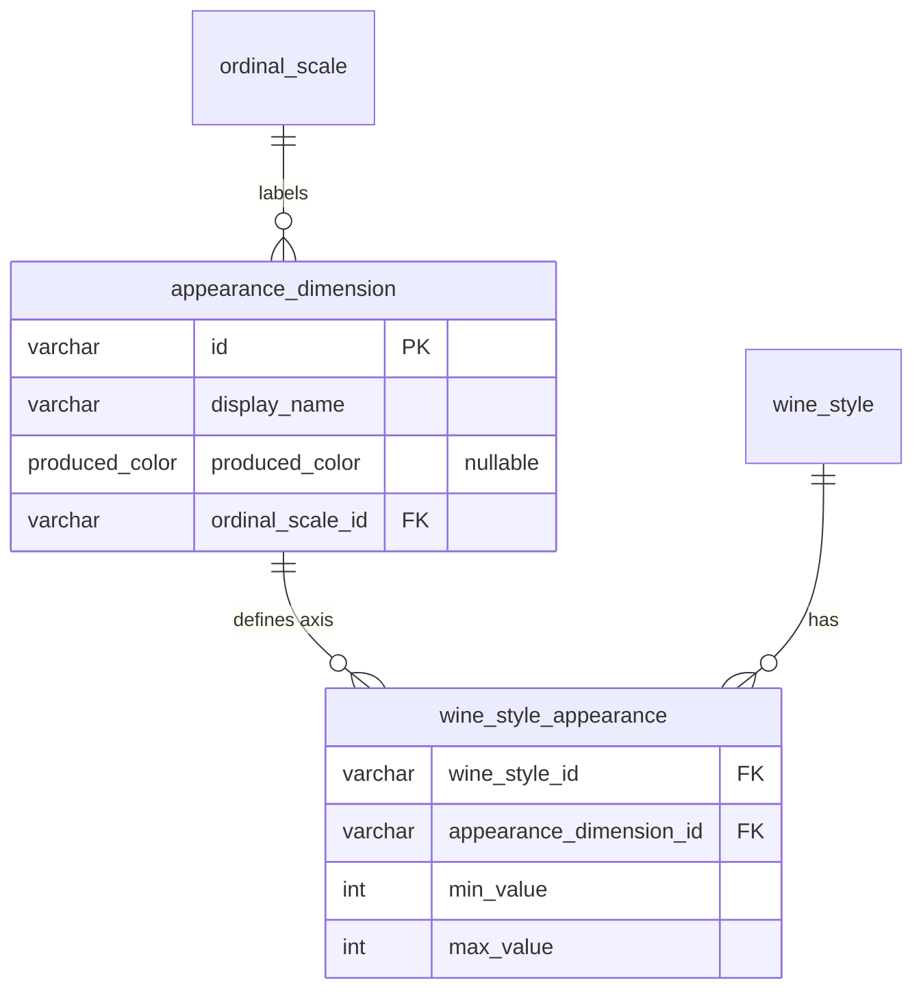

# Add Wine Appearance Tables (Color Intensity + Color Hue)

## Approach

Follow the established pattern where each assessment domain has its own table family. Aromas have `aroma_source` / `aroma_cluster` / `aroma_descriptor` + junctions. Structure has `structure_dimension` + `wine_style_structure`. Appearance will get `appearance_dimension` + `wine_style_appearance`.

The `appearance_dimension` table carries a nullable `produced_color` column — `null` means "applies to all colors" (Color Intensity), non-null means "only for styles of this color" (each hue variant). This naturally handles the color-dependent hue labels without artificial dimension splitting.

Reuses the existing `ordinal_scale` table for label sets.

## Data Model

**New ordinal scales:**

- `color_intensity_3`: ["Pale", "Medium", "Deep"]
- `color_hue_red_5`: ["Purple", "Ruby", "Garnet", "Tawny", "Brown"]
- `color_hue_white_5`: ["Lemon-green", "Lemon", "Gold", "Amber", "Brown"]
- `color_hue_rose_3`: ["Pink", "Salmon", "Orange"]

**New appearance dimensions:**

- `color_intensity` — producedColor: null, ordinalScaleId: `color_intensity_3`
- `color_hue_red` — producedColor: "red", ordinalScaleId: `color_hue_red_5`
- `color_hue_white` — producedColor: "white", ordinalScaleId: `color_hue_white_5`
- `color_hue_rose` — producedColor: "rose", ordinalScaleId: `color_hue_rose_3`

## File Changes

### 1. DB Schema — [packages/db/src/schema/attributes.ts](packages/db/src/schema/attributes.ts)

Add two new tables after the existing `wineStyleStructure`:

- `appearanceDimension`: id, displayName, producedColor (nullable, uses existing `producedColorEnum`), ordinalScaleId (FK to ordinal_scale)
- `wineStyleAppearance`: wineStyleId + appearanceDimensionId (composite PK), minValue, maxValue, CHECK constraint adapted for variable scale sizes (1-5 is fine — 3-label dimensions will just use 1-3)

### 2. Shared Schemas — [packages/shared/src/schemas.ts](packages/shared/src/schemas.ts)

- Relax `ordinalScaleSchema.labels` from `.length(5)` to `.min(2)` (3-label scales are now valid)
- Add `appearanceDimensionSchema`, `wineStyleAppearanceSchema`
- Add composite types: `AppearanceDimensionWithScale`, `WineStyleAppearanceWithDimension`
- Extend `wineStyleFullSchema` with `appearance: z.array(wineStyleAppearanceWithDimensionSchema).optional()`

### 3. Seed Data — [packages/db/src/seed.ts](packages/db/src/seed.ts)

- Add 4 new ordinal scales (variable-length labels)
- Add 4 appearance dimensions
- Add appearance values for each of the 11 existing seeded wine styles (sensible WSET-aligned benchmark values)

### 4. Migration — run `drizzle-kit generate`

Generate DDL for the two new tables. No existing table alterations needed.

### 5. API — [apps/api/src/routes/read.ts](apps/api/src/routes/read.ts)

- Add `GET /appearance-dimensions` endpoint (mirrors `/structure-dimensions` pattern)
- Extend `buildWineStyleFull()` to query `wineStyleAppearance` + `appearanceDimension`, attach to response as `appearance` array
- Import new tables

### 6. Frontend API Client — [apps/web/src/api/client.ts](apps/web/src/api/client.ts)

- Add `getAppearanceDimensions()` method

### 7. Frontend Detail Page — [apps/web/src/pages/explore/WineStyleDetailPage.tsx](apps/web/src/pages/explore/WineStyleDetailPage.tsx)

- Add an "Appearance" card section between the metadata chips and the Structure section
- Render appearance dimensions using `WineAttributeBar` with **data-driven** `scaleMax` derived from `dim.ordinalScale.labels.length` instead of hard-coded `5`
- Also fix the existing Structure section's `scaleMax = 5` to be data-driven from the ordinal scale

## Existing Code Left Untouched

- **Confusion service** (`apps/api/src/services/confusion.ts`): Hard-codes structural dimension IDs for similarity — appearance dimensions are a separate domain and should not participate in confusion calculations
- **Radar / visualization components**: Hard-code structural dimension subsets for radar charts — appearance doesn't belong on palate radars
- **StyleCard, FlavorMap, ClimateGradient**: Reference specific structural dimensions — no change needed

