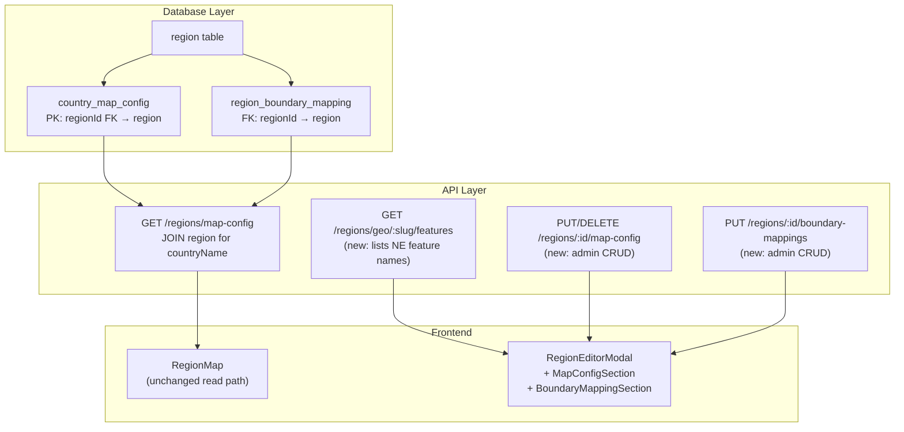

# Region Management: FK Migration, Admin API, and Admin UI

## Problem

Adding a region that is visible on `/explore/regions` requires manual DB inserts into `country_map_config` and `region_boundary_mapping`. The current `countryName` PK is a soft string match against `region.displayName` with no FK — renaming a country silently breaks the map.

## Architecture Overview




---

## Phase 1: Database Schema

### 1a. Rewrite `countryMapConfig` table

In [packages/db/src/schema/mapConfig.ts](packages/db/src/schema/mapConfig.ts), replace the `countryName` PK with a `regionId` FK to `region.id`. Change `isMappable` default from `true` to `false` (draft-first):

```typescript
export const countryMapConfig = pgTable("country_map_config", {
  regionId: varchar("region_id", { length: 64 })
    .primaryKey()
    .references(() => region.id, { onDelete: "cascade" }),
  isoNumeric: integer("iso_numeric").notNull(),
  geoSlug: varchar("geo_slug", { length: 64 }).notNull(),
  naturalEarthAdminName: varchar("natural_earth_admin_name", { length: 128 }).notNull(),
  zoomCenterLon: real("zoom_center_lon").notNull(),
  zoomCenterLat: real("zoom_center_lat").notNull(),
  zoomLevel: real("zoom_level").notNull(),
  isMappable: boolean("is_mappable").notNull().default(false),
});
```

`regionBoundaryMapping` already has a proper FK — no change needed.

### 1b. Generate migration

Run `drizzle-kit generate`. Because the PK column changes, the migration will drop/recreate. Review the generated SQL to confirm it handles the transition correctly. After migrating, re-run seed to populate the new `regionId`-based rows.

### 1c. Update seed

In [packages/db/src/seed.ts](packages/db/src/seed.ts), change the `countryConfigs` array entries from `countryName: "France"` to `regionId: "france"` (matching the region table ID). Set `isMappable: true` for all seeded countries since they are fully configured.

---

## Phase 2: Shared Schemas

In [packages/shared/src/schemas.ts](packages/shared/src/schemas.ts):

- **Update `countryMapConfigSchema`** — add `regionId`, keep `countryName` (now computed by API from join):

```typescript
  export const countryMapConfigSchema = z.object({
    regionId: z.string(),
    countryName: z.string(),
    isoNumeric: z.number(),
    geoSlug: z.string(),
    naturalEarthAdminName: z.string(),
    zoomCenterLon: z.number(),
    zoomCenterLat: z.number(),
    zoomLevel: z.number(),
    isMappable: z.boolean().optional(),
  });
  

```

- **Add `countryMapConfigUpsertSchema`** (admin input — regionId comes from URL param):

```typescript
  export const countryMapConfigUpsertSchema = z.object({
    isoNumeric: z.number().int(),
    geoSlug: z.string().min(1).max(64),
    naturalEarthAdminName: z.string().min(1).max(128),
    zoomCenterLon: z.number(),
    zoomCenterLat: z.number(),
    zoomLevel: z.number().positive(),
    isMappable: z.boolean().optional(),
  });
  

```

- **Add `boundaryMappingsUpsertSchema`**:

```typescript
  export const boundaryMappingsUpsertSchema = z.object({
    featureNames: z.array(z.string().min(1)),
  });
  

```

- **Add `geoFeaturesResponseSchema`** (includes auto-suggested center/zoom):

```typescript
export const geoSuggestionsSchema = z.object({
  centerLon: z.number(),
  centerLat: z.number(),
  suggestedZoom: z.number(),
});
export type GeoSuggestions = z.infer<typeof geoSuggestionsSchema>;

export const geoFeaturesResponseSchema = z.object({
  featureNames: z.array(z.string()),
  suggestions: geoSuggestionsSchema.nullable(),
});
export type GeoFeaturesResponse = z.infer<typeof geoFeaturesResponseSchema>;
```

Export all new schemas and types.

---

## Phase 3: API — Geo Service

In [apps/api/src/services/geo.ts](apps/api/src/services/geo.ts), add two functions:

### 3a. `getCountryFeatureNames`

Returns sorted, deduplicated admin-1 feature names for a given Natural Earth country. Powers the boundary-mapping dropdown.

```typescript
export function getCountryFeatureNames(naturalEarthAdminName: string): string[] {
  const geo = loadGeoData();
  const names = geo.features
    .filter((f) => f.properties["admin"] === naturalEarthAdminName)
    .map((f) => f.properties["name"] as string)
    .filter(Boolean);
  return [...new Set(names)].sort();
}
```

### 3b. `getCountryGeoSuggestions`

Computes suggested `centerLon`, `centerLat`, and `zoomLevel` from the Natural Earth features. Each feature already has `latitude` and `longitude` properties. Use **median** (not mean) to be robust against overseas territories (e.g., French Guiana skewing France's center). Suggest zoom from the IQR-filtered latitude span.

Validated against existing hand-tuned seed data:

- France: median `(46.68, 2.52)` vs seed `(46.5, 2.5)` -- very close
- Italy: median `(43.54, 11.97)` vs seed `(42.5, 12.5)` -- close
- USA: suggested zoom `3` matches seed exactly

```typescript
type GeoSuggestions = {
  centerLon: number;
  centerLat: number;
  suggestedZoom: number;
};

export function getCountryGeoSuggestions(
  naturalEarthAdminName: string
): GeoSuggestions | null {
  const geo = loadGeoData();
  const features = geo.features.filter(
    (f) => f.properties["admin"] === naturalEarthAdminName
  );
  if (features.length === 0) return null;

  const lats = features.map((f) => f.properties["latitude"] as number).filter(Boolean).sort((a, b) => a - b);
  const lons = features.map((f) => f.properties["longitude"] as number).filter(Boolean).sort((a, b) => a - b);
  if (lats.length === 0) return null;

  const median = (arr: number[]) => arr[Math.floor(arr.length / 2)];
  const centerLat = median(lats);
  const centerLon = median(lons);

  // IQR-filtered lat span for zoom estimation
  const n = lats.length;
  const q1 = lats[Math.floor(n / 4)];
  const q3 = lats[Math.floor((3 * n) / 4)];
  const iqr = q3 - q1;
  const filtered = lats.filter((l) => l >= q1 - 1.5 * iqr && l <= q3 + 1.5 * iqr);
  const span = filtered[filtered.length - 1] - filtered[0];
  const suggestedZoom = span > 0 ? Math.max(1, Math.min(8, Math.round(Math.log2(180 / span)))) : 5;

  return { centerLon: Math.round(centerLon * 100) / 100, centerLat: Math.round(centerLat * 100) / 100, suggestedZoom };
}
```

---

## Phase 4: API — Route Changes

All in [apps/api/src/routes/read.ts](apps/api/src/routes/read.ts):

### 4a. Update `GET /regions/map-config`

Join `countryMapConfig` with `region` to compute `countryName` from `region.displayName`:

```typescript
const countries = await db
  .select({
    regionId: countryMapConfig.regionId,
    countryName: region.displayName,
    isoNumeric: countryMapConfig.isoNumeric,
    geoSlug: countryMapConfig.geoSlug,
    naturalEarthAdminName: countryMapConfig.naturalEarthAdminName,
    zoomCenterLon: countryMapConfig.zoomCenterLon,
    zoomCenterLat: countryMapConfig.zoomCenterLat,
    zoomLevel: countryMapConfig.zoomLevel,
    isMappable: countryMapConfig.isMappable,
  })
  .from(countryMapConfig)
  .innerJoin(region, eq(countryMapConfig.regionId, region.id))
  .orderBy(region.displayName);
```

The response shape remains compatible with `regionsMapConfigResponseSchema` — the frontend gets the same `countryName` it uses today, so `RegionMap` needs zero changes.

### 4b. Add `GET /regions/geo/:geoSlug/features`

Public endpoint. Looks up `naturalEarthAdminName` from `countryMapConfig` by `geoSlug`, then calls both `getCountryFeatureNames()` and `getCountryGeoSuggestions()`. Returns `{ featureNames: string[], suggestions: { centerLon, centerLat, suggestedZoom } | null }`.

### 4c. Add `PUT /regions/:id/map-config` (admin)

- Validate body with `countryMapConfigUpsertSchema`
- Verify region exists and `regionLevel === "country"`
- Upsert into `countryMapConfig` (insert on conflict update)
- Return the saved row

### 4d. Add `DELETE /regions/:id/map-config` (admin)

- Delete from `countryMapConfig` where `regionId = :id`
- Return 204

### 4e. Add `GET /regions/:id/boundary-mappings`

- Return `featureNames: string[]` from `regionBoundaryMapping` for the given regionId

### 4f. Add `PUT /regions/:id/boundary-mappings` (admin)

- Validate body with `boundaryMappingsUpsertSchema`
- Delete existing rows for `regionId`, insert new rows (replace strategy)
- Return the saved feature names

---

## Phase 5: Frontend API Client

### 5a. Update types in [apps/web/src/api/client.ts](apps/web/src/api/client.ts)

- Import new types: `CountryMapConfigUpsert`, `BoundaryMappingsUpsert`, `GeoFeaturesResponse`
- Add to `api` object:
  - `getGeoFeatures(geoSlug: string): Promise<GeoFeaturesResponse>`
  - `getBoundaryMappings(regionId: string): Promise<{ featureNames: string[] }>`
- Add to `adminApi` object:
  - `upsertMapConfig(accessToken, regionId, body): Promise<CountryMapConfig>`
  - `deleteMapConfig(accessToken, regionId): Promise<void>`
  - `upsertBoundaryMappings(accessToken, regionId, body): Promise<{ featureNames: string[] }>`

### 5b. Add query keys in [apps/web/src/api/queryKeys.ts](apps/web/src/api/queryKeys.ts)

```typescript
geoFeatures: (geoSlug: string) => ["geo-features", geoSlug] as const,
boundaryMappings: (regionId: string) => ["boundary-mappings", regionId] as const,
mapConfig: (regionId: string) => ["map-config", regionId] as const,
```

---

## Phase 6: Frontend Admin UI

All in [apps/web/src/components/admin/RegionEditorModal.tsx](apps/web/src/components/admin/RegionEditorModal.tsx).

### Existing design patterns to follow

The current `RegionDetailPanel` component (line 175-487) establishes these conventions:

- **State init from region**: a `useEffect` keyed on `region?.id` resets all local state (lines 201-212)
- **Debounced auto-save**: `scheduleAutoSave` clears/sets a 600ms `setTimeout` ref, calls a `useMutation` (lines 256-266)
- **Save status**: `saveStatus: "idle" | "saving" | "saved" | "error"` with the status line rendered as `text-xs text-muted-foreground` (lines 471-478)
- **Mutation pattern**: `useMutation` with `onSuccess` that calls `queryClient.invalidateQueries`, sets status to `"saved"`, and resets after 2s (lines 214-228)
- **Input styling**: `w-full px-3 py-2 rounded-md bg-card border border-input text-foreground focus:ring-2 focus:ring-accent`
- **Label styling**: `block text-sm font-medium text-foreground mb-1`
- **Subsection containers**: `p-4 rounded-lg bg-muted/40 border border-border space-y-3` with heading `text-sm font-medium text-foreground` (see the "Add child form" at lines 338-416)
- **Buttons**: `Button` component from `../../components/ui/Button` with variants `hero`, `outline`, `ghost`, `destructive` and size `sm`
- **Error display**: `<p className="text-sm text-destructive">{error}</p>`

New sections should be rendered inside the same `<div className="flex-1 overflow-y-auto p-6 space-y-5">` container, below the existing editable fields and above the read-only metadata footer.

### 6a. `MapConfigSection` (country-level regions)

Extract as a separate component rendered inside `RegionDetailPanel` when `region.regionLevel === "country"`. It manages its own state, queries, and mutations independently from the parent's region-field auto-save.

**Data flow:**

- `useQuery` on `queryKeys.regionsMapConfig` to get the full map config list (already fetched elsewhere, so it will come from cache). Filter to find the entry where `regionId === region.id`. If none exists, the form starts empty.
- `useMutation` calling `adminApi.upsertMapConfig(accessToken, region.id, body)`.
- On success, invalidate `queryKeys.regionsMapConfig`.

**State (reset via `useEffect` on `region.id`):**

- `cfgIsoNumeric: string` (input as string, parsed to int on save)
- `cfgNaturalEarthAdminName: string`
- `cfgGeoSlug: string`
- `cfgZoomCenterLon: string`
- `cfgZoomCenterLat: string`
- `cfgZoomLevel: string`
- `cfgIsMappable: boolean`
- `cfgSaveStatus: "idle" | "saving" | "saved" | "error"`
- `cfgSaveError: string`

**UI layout** (inside a `p-4 rounded-lg bg-muted/40 border border-border space-y-3` container):

1. **Section heading:** "Map Configuration" with a `Map` icon (from lucide-react)
2. **Warning banner** (conditional):
  - If no existing config: a `bg-amber-500/10 border-amber-500/30 text-amber-700 dark:text-amber-400` rounded div: "This country is not visible on the explore map. Fill in the fields below to configure it."
  - If config exists but `isMappable === false`: same style: "This country is in draft mode and not yet visible on the map."
3. `**naturalEarthAdminName` input** (text): label "Natural Earth Admin Name *", placeholder "e.g. New Zealand". Helper text below: `text-xs text-muted-foreground` explaining this must match the `admin` property in the Natural Earth dataset.
4. **"Suggest defaults" button**: a `Button variant="outline" size="sm"` labeled "Auto-suggest center & zoom". When clicked:
  - Fetch `api.getGeoFeatures(cfgGeoSlug)` (requires geoSlug to be filled first; disable button if empty)
  - If `response.suggestions` is non-null, populate `cfgZoomCenterLon`, `cfgZoomCenterLat`, `cfgZoomLevel` from `suggestions.centerLon`, `suggestions.centerLat`, `suggestions.suggestedZoom`
  - If null, show a brief inline error: "No features found for this admin name."
  - This is a one-shot action, not auto-save. The user can review and adjust before saving.
5. **Fields in a 2-column grid** (`grid grid-cols-2 gap-3`):
  - `isoNumeric` (number input): label "ISO Numeric *", placeholder "e.g. 554"
  - `geoSlug` (text input, `font-mono`): label "Geo Slug *", placeholder "e.g. new_zealand"
  - `zoomCenterLon` (number input, `step="0.01"`): label "Center Longitude *"
  - `zoomCenterLat` (number input, `step="0.01"`): label "Center Latitude *"
  - `zoomLevel` (number input, `step="0.5" min="1" max="8"`): label "Zoom Level *"
6. `**isMappable` checkbox**: a `<label>` with an `<input type="checkbox">` and text "Visible on explore map". Placed below the grid.
7. **Save button**: `Button variant="hero" size="sm"` labeled "Save map config". This is explicit-save (not auto-save) because the fields are interdependent and partially require external lookup. Disabled when required fields are empty or mutation is pending.
8. **Save status line**: same pattern as parent — `text-xs text-muted-foreground` showing saving/saved/error state.

**Note:** Unlike the parent's auto-save for name/level/notes, map config uses an **explicit save button** because:

- Fields are interdependent (geoSlug must be valid before suggesting center)
- The "suggest defaults" workflow is interactive
- Accidentally saving a half-filled config with auto-save would create a broken map entry

### 6b. `BoundaryMappingsSection` (sub-regions under mappable countries)

Extract as a separate component rendered inside `RegionDetailPanel` when the region has a `parentId` pointing to a country-level region that has a map config entry.

**Determining parent country config:** The component receives `allRegions` and the `mapConfig` query data. Walk `parentId` to find the country-level ancestor. Look up that ancestor's `regionId` in the map config list. If found and it has a `geoSlug`, render the section. Otherwise skip.

**Data flow:**

- `useQuery` on `queryKeys.geoFeatures(parentGeoSlug)` calling `api.getGeoFeatures(parentGeoSlug)` to get the list of available Natural Earth feature names.
- `useQuery` on `queryKeys.boundaryMappings(region.id)` calling `api.getBoundaryMappings(region.id)` to get currently saved mappings.
- `useMutation` calling `adminApi.upsertBoundaryMappings(accessToken, region.id, { featureNames })`.
- On success, invalidate both `queryKeys.boundaryMappings(region.id)` and `queryKeys.regionsMapConfig`.

**State:**

- `selectedFeatures: Set<string>` — initialized from the boundary mappings query
- `searchFilter: string` — to filter the feature name list
- `bndSaveStatus: "idle" | "saving" | "saved" | "error"`

**UI layout** (inside a `p-4 rounded-lg bg-muted/40 border border-border space-y-3` container):

1. **Section heading:** "Boundary Mappings" with a `MapPin` icon
2. **Warning banner** (if no mappings saved): "No map boundaries configured. This sub-region won't highlight on the country map."
3. **Search filter input**: `placeholder="Filter features…"` with standard input styling, narrower (`max-w-xs`)
4. **Feature name list**: a scrollable `max-h-48 overflow-y-auto` container with checkboxes. Each item:
  - `<label className="flex items-center gap-2 px-2 py-1 rounded hover:bg-muted/60 cursor-pointer text-sm">`
  - `<input type="checkbox">` bound to `selectedFeatures`
  - Feature name text
  - Items filtered by `searchFilter`
  - If the `geoFeatures` query is loading, show `text-xs text-muted-foreground`: "Loading features..."
5. **Selected count**: `text-xs text-muted-foreground` showing e.g. "3 features selected"
6. **Save button**: `Button variant="hero" size="sm"` labeled "Save mappings". Explicit save (not auto-save) since the user selects multiple checkboxes before committing. Disabled when mutation is pending.
7. **Save status line**: same pattern.

### 6c. Status indicators in the tree

Enrich the `RegionEditorModal` top-level component to also fetch map config data:

- Add a `useQuery` on `queryKeys.regionsMapConfig` inside `RegionEditorModal`
- Derive two `Set`s: `countriesWithMapConfig` (regionIds that have map config) and `regionsWithBoundaryMappings` (regionIds that appear in `boundaryMappings`)
- Pass these sets down to `TreeNode` as props

In `TreeNode`, next to the region `displayName`, render a small indicator:

- For `regionLevel === "country"` without map config: a `w-2 h-2 rounded-full bg-amber-500` dot (amber = needs attention)
- For sub-regions under a mappable country without boundary mappings: same amber dot
- For fully configured: no indicator (clean tree)

This gives the admin instant visibility into which regions still need geo configuration.

---

## Summary of Files Changed

- `packages/db/src/schema/mapConfig.ts` — rewrite `countryMapConfig` PK
- `packages/db/src/seed.ts` — use `regionId` in seed data
- `packages/db/drizzle/[generated].sql` — drizzle-kit migration
- `packages/shared/src/schemas.ts` — new/updated Zod schemas
- `apps/api/src/services/geo.ts` — add `getCountryFeatureNames`
- `apps/api/src/routes/read.ts` — update map-config query, add 5 new endpoints
- `apps/web/src/api/client.ts` — add API client methods
- `apps/web/src/api/queryKeys.ts` — add query keys
- `apps/web/src/components/admin/RegionEditorModal.tsx` — map config + boundary UI

