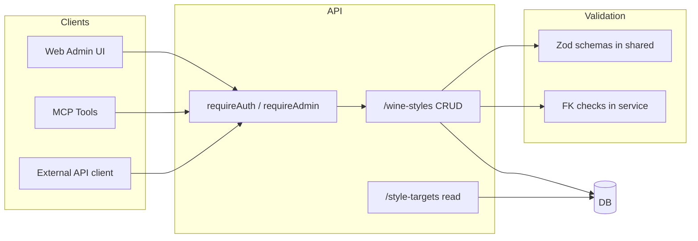

# Wine styles CRUD, API, admin UI, and MCP tools

## Current state

- **Wine style model**: Core table `wine_style` in [packages/db/src/schema/grapes.ts](packages/db/src/schema/grapes.ts) plus junction tables: `wine_style_grape`, `wine_style_structure`, `wine_style_appearance`, `wine_style_aroma_cluster`, `wine_style_aroma_descriptor`. Shared Zod schemas in [packages/shared/src/schemas.ts](packages/shared/src/schemas.ts) (`wineStyleSchema`, `wineStyleFullSchema`, and related).
- **API**: Fastify in `apps/api`; read-only routes in [apps/api/src/routes/read.ts](apps/api/src/routes/read.ts) (`GET /style-targets`, `GET /style-targets/:id`, plus `buildWineStyleFull`). Auth: JWT in [apps/api/src/auth](apps/api/src/auth) with `requireAuth`; no roles.
- **Web**: React + Vite in `apps/web`, [ProtectedRoute](apps/web/src/components/ProtectedRoute.tsx) (auth only), no admin check. API client in [apps/web/src/api/client.ts](apps/web/src/api/client.ts) does not send `Authorization` for data calls.
- **MCP**: No MCP server in the repo; Cursor’s MCP folder is for external servers (e.g. cursor-ide-browser).

---

## 1. Admin role and auth

- **DB**: Add `role` to `user` table (e.g. `varchar('role', 32).notNull().default('user')` with values `user` | `admin`). Add migration in `packages/db`. Seed at least one admin user (e.g. from env or a known email).
- **JWT**: Extend [apps/api/src/auth/jwt.ts](apps/api/src/auth/jwt.ts) `AccessPayload` with `role: 'user' | 'admin'`. On login/register in [apps/api/src/auth/routes.ts](apps/api/src/auth/routes.ts), load user from DB and pass `role` into `signAccess`. Keep payload minimal (e.g. `userId`, `email`, `role`, `type`).
- **API**: Add `requireAdmin` in [apps/api/src/auth/preHandler.ts](apps/api/src/auth/preHandler.ts): run after `requireAuth`, then check `req.user.role === 'admin'` (or load user from DB if role is not in JWT). Return 403 if not admin.
- **Web**: Extend `GET /me` response to include `role`. In [AuthContext](apps/web/src/contexts/AuthContext.tsx) (or types), store `role` so the UI can show admin-only sections. Add a helper that returns `Authorization: Bearer ${accessToken}` for authenticated API calls and use it for all admin and protected endpoints.

---

## 2. REST API: wine-styles CRUD with validation

- **Resource and routes**: Introduce `/wine-styles` as the single resource for CRUD:
  - `GET /wine-styles` — list all (same shape as current style-targets list). Can remain public or require auth; recommend public for read so MCP and admin UI can list without token.
  - `GET /wine-styles/:id` — one by id (same as current style-target detail). Public or auth.
  - `POST /wine-styles` — create (body: core + optional relations). **requireAdmin**.
  - `PUT /wine-styles/:id` — full replace (core + relations). **requireAdmin**.
  - `DELETE /wine-styles/:id` — delete style (cascades to junction tables). **requireAdmin**.
  Keep existing `/style-targets` and `/style-targets/:id` as-is for backward compatibility (same handlers or internal reuse).
- **Shared request/response schemas** ([packages/shared/src/schemas.ts](packages/shared/src/schemas.ts)):
  - **Create**: `wineStyleCreateSchema` — core fields only at minimum: `displayName`, `styleType`, `producedColor`, `wineCategory`, optional `regionId`, `climateMin`, `climateMax`, `climateOrdinalScaleId`, `notes`. Optionally extend with optional arrays: `grapes` (e.g. `{ grapeVarietyId, percentage? }`), `structure` (`structureDimensionId`, `minValue`, `maxValue`), `appearance`, `aromaClusters`, `aromaDescriptors`, with Zod refinements for value ranges and FK existence (or validate FKs in service).
  - **Update**: `wineStyleUpdateSchema` — same shape as create but all fields optional except identity; or require full body for PUT. Use `.strict()` to reject unknown keys.
  - **ID param**: validate `id` (e.g. non-empty string, max length 64) and 404 when not found.
- **Validation in API**:
  - Parse body with the appropriate Zod schema; on failure return 400 with a clear message (e.g. `error.format()` or a sanitized message).
  - **Referential integrity**: Before insert/update, validate that referenced ids exist (region, ordinal scale, grape variety, structure/appearance dimensions, aroma cluster/descriptor). Return 400 with which reference failed if not. Optionally add a small shared “reference checker” that takes a list of FK checks and returns the first missing id.
  - **Business rules**: Reuse DB constraints where possible (e.g. climate min/max 1–5, min ≤ max; grape percentage 0–100). Enforce in Zod or in service and return 400.
- **Service layer** (e.g. `apps/api/src/services/wineStyleService.ts`):
  - **create**: Generate `id` (e.g. nanoid or slug from displayName + collision check). Insert into `wine_style`, then insert into junction tables. Return full style via existing `buildWineStyleFull`-style helper.
  - **update**: Update `wine_style` row; delete and re-insert junction rows for grapes, structure, appearance, aroma clusters, descriptors (or diff and update; replace is simpler and consistent).
  - **delete**: Delete by id (cascade will clear junctions). Return 204 or 200 with `{ deleted: true }`.
- **Response**: After create/update, return the full wine style (same shape as `GET /wine-styles/:id`) and parse with `wineStyleFullSchema` before sending. Use consistent error shape: `{ error: string, message?: string }`.
- **Registration**: New file `apps/api/src/routes/wineStyles.ts` that registers the five routes; call it from [apps/api/src/index.ts](apps/api/src/index.ts) after auth and read routes. Use shared `buildWineStyleFull` (extract from read.ts into a shared service or import from read) so list/detail responses stay identical.

---

## 3. Frontend: authenticated client and admin page

- **API client** ([apps/web/src/api/client.ts](apps/web/src/api/client.ts)):
  - Add a way to send the access token: e.g. `getAuthHeaders(): Record<string, string>` that reads token from a passed-in value or from a small “auth holder” (context/store). For admin endpoints, use `fetch(url, { headers: { ...getAuthHeaders(), 'Content-Type': 'application/json' }, ... })`.
  - Add methods: `getWineStyles()`, `getWineStyle(id)`, `createWineStyle(body)`, `updateWineStyle(id, body)`, `deleteWineStyle(id)`. All use `base()`; mutations use `getAuthHeaders()` and JSON body. Handle 403 (not admin) and 400 (validation) with clear errors.
- **Admin guard**:
  - Add `AdminRoute` component: inside it use `useAuth()`; if not logged in redirect to login; if logged in and `user.role !== 'admin'` redirect to `/` or show “Forbidden”. Reuse same pattern as [ProtectedRoute](apps/web/src/components/ProtectedRoute.tsx).
  - Ensure `/me` is called after login so that `user.role` is available (or include role in login response and store it).
- **Admin layout and route**:
  - Route: e.g. `/admin` and `/admin/wine-styles` (and optionally `/admin/wine-styles/new`, `/admin/wine-styles/:id/edit`) in [apps/web/src/App.tsx](apps/web/src/App.tsx), wrapped in `AdminRoute`. Use a simple admin layout (sidebar or top nav) that links to “Database” or “Wine styles” and logout.
- **Admin “database” / wine-styles page** (beautiful, maintainable):
  - **List view**: Table or card grid of wine styles (reuse or mirror [ExploreStylesPage](apps/web/src/pages/explore/ExploreStylesPage.tsx) patterns). Columns: name, style type, color, category, region (optional). Actions: Edit, Delete. “New wine style” button. Use existing design tokens (e.g. Tailwind, `text-foreground`, `text-muted-foreground`) and a clear hierarchy; consider a dedicated admin palette (e.g. subtle background, clear table borders) so it feels like an editing tool.
  - **Create/Edit form**: Single form for core fields (displayName, styleType, producedColor, wineCategory, regionId dropdown, climate min/max, scale, notes). Optional sections for grapes (multi-select or list with percentage), structure dimensions (dimension + min/max), appearance, aroma clusters, aroma descriptors. Load reference data (regions, grapes, structure dimensions, etc.) via existing API. Validate client-side with the same Zod schemas (import from shared) or a thin wrapper; show field-level errors. On submit call `createWineStyle` or `updateWineStyle`; on success redirect to list or detail and invalidate relevant React Query keys.
  - **Delete**: Confirmation modal or inline “Are you sure?”; then `deleteWineStyle(id)` and invalidate list.
  - **UX**: Loading and error states (use React Query and a small toast or inline error area). Avoid overwhelming the user: start with core fields and expandable sections for relations, or tabs (Core / Grapes / Structure / Appearance / Aromas).
- **Navigation**: In [Navbar](apps/web/src/components/landing/Navbar.tsx) or main layout, show “Admin” link only when `user.role === 'admin'`, pointing to `/admin` or `/admin/wine-styles`.

---

## 4. MCP server and tools

- **New package**: Add `packages/mcp-wine` (or `apps/mcp-server`) in the monorepo. Use the official MCP SDK (`@modelcontextprotocol/sdk`) and implement a **stdio-based** server that Cursor can launch. Dependencies: Node, TypeScript, and the MCP SDK; no direct DB dependency — the server will call the wine-app REST API so all validation stays in the API.
- **Configuration**: Env vars: `WINE_APP_API_URL` (e.g. `http://localhost:3000`), and for write operations `WINE_APP_ADMIN_TOKEN` (access token) or `WINE_APP_API_KEY` if you add API-key auth later. Document in README how to get an admin token (e.g. login as admin and copy from devtools or a small script).
- **Tools** (names can follow MCP conventions, e.g. `wine_`*):
  - `wine_list_styles` — GET /wine-styles (or /style-targets), return list (optionally with query params for filter later).
  - `wine_get_style` — GET /wine-styles/:id, return one style.
  - `wine_create_style` — POST /wine-styles with JSON body; require admin token in header. Arguments: same as create schema (e.g. displayName, styleType, producedColor, wineCategory, optional regionId, notes, optional grapes/structure/…).
  - `wine_update_style` — PUT /wine-styles/:id with JSON body; require admin token.
  - `wine_delete_style` — DELETE /wine-styles/:id; require admin token.
- **Implementation**: Each tool handler builds the URL and optional body, adds `Authorization: Bearer ${WINE_APP_ADMIN_TOKEN}` for create/update/delete, calls `fetch`, then returns the JSON response or a clear error (e.g. 403 “admin required”, 400 “validation error: …”). Tool schemas (parameters) should describe the expected JSON shape; you can reference the shared Zod schemas in docs or duplicate minimal JSON Schema for the MCP tool definitions.
- **Discovery**: Add a short README in the MCP package explaining how to add the server to Cursor (e.g. in Cursor settings, MCP section, add a server that runs `node packages/mcp-wine/dist/index.js` or `pnpm --filter mcp-wine start` with env from a `.env` file). No need to implement Cursor-specific config files in the repo unless you want to ship a default.

---

## 5. Summary diagram

---

## 6. Implementation order

1. **DB + auth**: Add `role` column and migration; extend JWT and login; add `requireAdmin`; extend `/me` and frontend auth state with role.
2. **Shared schemas**: Add `wineStyleCreateSchema` and `wineStyleUpdateSchema` (and any body/param schemas) in `packages/shared`.
3. **API CRUD**: Extract or reuse `buildWineStyleFull`; implement wine-styles service (create/update/delete with FK validation); register GET/POST/PUT/DELETE under `/wine-styles` with `requireAdmin` on mutations.
4. **Frontend**: Add auth headers to client; implement `AdminRoute`; add admin layout and `/admin/wine-styles` list + create/edit form + delete; show Admin link for admins only.
5. **MCP**: New package, stdio server, five tools calling the API with optional admin token; README for Cursor setup.

---

## 7. Decisions to confirm

- **Naming**: Using `/wine-styles` for the new CRUD resource keeps the API clear. Existing `/style-targets` remains for backward compatibility.
- **Scope of create/update**: Plan includes full payload (core + grapes, structure, appearance, aroma clusters, descriptors) with validation; you can phase by implementing core-only first and then adding nested relations.
- **MCP auth**: Write tools require an admin JWT in `WINE_APP_ADMIN_TOKEN`; read tools can work without auth if GET /wine-styles stays public.

